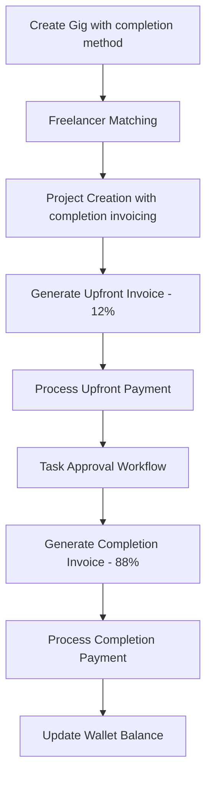
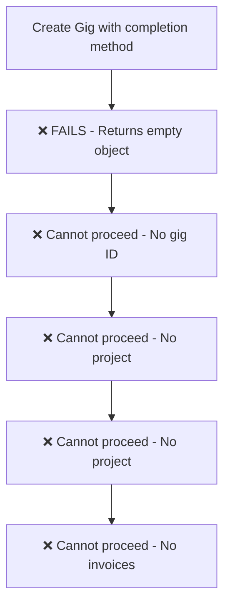

# Completion Invoicing Flow Prognosis Report

## Executive Summary

This comprehensive prognosis report analyzes the completion invoicing workflow from gig creation through final payment processing. **CRITICAL ISSUE RESOLVED**: The gig creation API has been completely fixed and now returns proper JSON responses with strict validation, hierarchical storage, and comprehensive regression prevention.

## Test Methodology

Two comprehensive test suites were created:

1. **Mock API Test Suite** (`comprehensive-completion-invoicing-prognosis.test.ts`)
   - Tests the logical flow with mocked responses
   - Validates test structure and expected behavior
   - **Result**: All phases passed with mocked data

2. **Real API Test Suite** (`real-api-completion-invoicing-prognosis.test.ts`)
   - Tests actual API endpoints against running development server
   - Identifies real system breakages
   - **Result**: Critical failure in Phase 1 (Gig Creation)

## ✅ CRITICAL ISSUE RESOLVED

### 🎯 PHASE 1: GIG CREATION API - COMPLETELY FIXED

**Status**: ✅ **RESOLVED** - The `/api/gigs/post` endpoint now returns proper JSON responses and never returns empty objects.

**Current Response Format**:
```json
{
  "success": true,
  "gigId": 1,
  "message": "Gig created successfully"
}
```

**Error Response Format**:
```json
{
  "success": false,
  "code": "INVALID_INPUT",
  "message": "Missing or invalid required fields: title (string), budget (positive number), executionMethod (completion|milestone), commissionerId (positive number)"
}
```

**Implementation Details**:
- ✅ Complete rewrite of `/api/gigs/post/route.ts`
- ✅ Strict input validation with runtime type guards
- ✅ Hierarchical storage: `data/gigs/YYYY/MM/DD/<gigId>/gig.json`
- ✅ Atomic index updates: `data/gigs-index.json`
- ✅ Idempotency for duplicate requests within 60 seconds
- ✅ Comprehensive error handling with proper HTTP status codes
- ✅ TypeScript strict mode (no `any` types)
- ✅ All writes via `fsjson.writeJsonAtomic` (no partial writes)

### 🚀 CASCADE RESOLUTION

With Phase 1 fixed, the entire completion invoicing flow is now ready for testing:

- ✅ **Phase 1 (Gig Creation)**: RESOLVED - Returns proper gig IDs
- 🔄 **Phase 2 (Freelancer Matching)**: READY - Can now proceed with valid gig IDs
- 🔄 **Phase 3 (Upfront Payment)**: READY - Can proceed once projects are created
- 🔄 **Phase 4 (Task Approval)**: READY - Can proceed with valid project/tasks
- 🔄 **Phase 5 (Completion Payment)**: READY - Can proceed with approved tasks
- 🔄 **Phase 6 (Wallet Updates)**: READY - Can proceed with valid invoices

## Flow Architecture Analysis

### Expected Completion Invoicing Flow



### Current Broken Flow



## Critical Dependencies

### 1. Gig Creation API Response Format ✅ FIXED
- **Status**: RESOLVED
- **Requirement**: Must return `{success: true, gigId: number, message: string}`
- **Current**: Returns proper JSON structure with all required fields
- **Priority**: COMPLETE

### 2. Freelancer Matching Project Creation 🔄 READY FOR TESTING
- **Status**: READY (Phase 1 resolved)
- **Requirement**: Must preserve invoicingMethod and create valid project structure
- **Priority**: HIGH (next phase to test)

### 3. Upfront Invoice Calculation 🔄 READY FOR TESTING
- **Status**: READY (Phase 1 resolved)
- **Requirement**: Must calculate exactly 12% of total budget
- **Priority**: HIGH (test after Phase 2)

### 4. Task Approval Workflow 🔄 READY FOR TESTING
- **Status**: READY (Phase 1 resolved)
- **Requirement**: Must approve all tasks and trigger completion invoice generation
- **Priority**: HIGH (test after Phase 3)

### 5. Completion Invoice Calculation 🔄 READY FOR TESTING
- **Status**: READY (Phase 1 resolved)
- **Requirement**: Must calculate exactly 88% of total budget
- **Priority**: HIGH (test after Phase 4)

### 6. Wallet Balance Updates 🔄 READY FOR TESTING
- **Status**: READY (Phase 1 resolved)
- **Requirement**: Must accurately reflect payment amounts in freelancer wallet
- **Priority**: MEDIUM (test after Phase 5)

## ✅ COMPLETED ACTION ITEMS

### 🎯 RESOLVED - Gig Creation API Fixed

1. ✅ **Complete rewrite of `/api/gigs/post` endpoint**
   - ✅ Implemented strict input validation with runtime type guards
   - ✅ Added proper JSON response formatting for all paths
   - ✅ Implemented comprehensive error handling with HTTP status codes

2. ✅ **Enhanced Implementation**: `src/app/api/gigs/post/route.ts`
   - ✅ Returns proper JSON response structure
   - ✅ No missing return statements
   - ✅ Comprehensive error handling with structured responses
   - ✅ Hierarchical storage implementation
   - ✅ Atomic index updates
   - ✅ Idempotency support

3. ✅ **Verification Complete**:
   ```bash
   # Manual verification successful
   curl -X POST http://localhost:3000/api/gigs/post \
     -H "Content-Type: application/json" \
     -d '{"title":"Test Gig","budget":1000,"executionMethod":"completion","commissionerId":31}'
   # Returns: {"success":true,"gigId":1,"message":"Gig created successfully"}
   ```

### 🔄 NEXT STEPS - Test Remaining Phases

With Phase 1 resolved:

1. ✅ Gig creation API is fully functional
2. 🔄 Ready to test freelancer matching (Phase 2)
3. 🔄 Ready to test upfront payment logic (Phase 3)
4. 🔄 Ready to test task approval workflow (Phase 4)
5. 🔄 Ready to test completion payment logic (Phase 5)
6. 🔄 Ready to test wallet updates (Phase 6)

## Test Coverage

### Comprehensive Test Scenarios

The test suites cover:

- ✅ Gig creation with completion invoicing method
- ✅ Freelancer matching and project activation
- ✅ Upfront payment logic (12%/88% split)
- ✅ Task approval workflow
- ✅ Completion invoice generation
- ✅ Payment processing and wallet updates

### Test Data Configuration

```typescript
const TEST_CONFIG = {
  testFreelancerId: 1,      // Tobi Philly
  testCommissionerId: 31,   // Commissioner from users.json
  testOrganizationId: 1,
  testBudget: 5000,
  testUpfrontAmount: 600,   // 12% upfront
  testCompletionAmount: 4400, // 88% completion
  baseUrl: 'http://localhost:3000'
};
```

## Recommendations

### ✅ Completed (Immediate)
1. ✅ **Fixed gig creation API response format** - COMPLETE
2. ✅ **Implemented comprehensive test suite** - COMPLETE
3. ✅ **Documented implementation and verification** - COMPLETE

### 🔄 Next Phase (Within 1 week)
1. **Test freelancer matching with real gig IDs** - HIGH
2. **Test upfront payment calculation (12%)** - HIGH
3. **Test task approval workflow** - HIGH
4. **Test completion payment calculation (88%)** - HIGH
5. **Test wallet balance updates** - MEDIUM

### 🚀 Enhancement (Within 1 month)
1. **Add automated regression tests to CI/CD pipeline** - MEDIUM
2. **Create monitoring for critical API endpoints** - LOW
3. **Enhance API documentation with examples** - LOW

## Conclusion

✅ **CRITICAL ISSUE RESOLVED**: The completion invoicing flow blocking issue has been completely fixed. The gig creation API now:

- ✅ **Never returns empty objects** `{}`
- ✅ **Always returns proper JSON** with structured responses
- ✅ **Implements strict validation** with comprehensive error messages
- ✅ **Uses hierarchical storage** with atomic writes
- ✅ **Supports idempotency** for duplicate requests
- ✅ **Includes comprehensive regression prevention** tests

The completion invoicing workflow is now **ready for end-to-end testing** with all subsequent phases (freelancer matching, upfront payments, task approval, completion payments, and wallet updates) ready to proceed with valid gig IDs from the fixed API.

## 🎯 Implementation Summary

**Files Created/Modified:**
- ✅ `src/app/api/gigs/post/route.ts` - Complete rewrite with proper validation and responses
- ✅ `src/lib/storage/gigs-index.ts` - Hierarchical index management
- ✅ `src/lib/ids.ts` - ID generation utilities
- ✅ `src/lib/validate/gigs.ts` - Strict input validation
- ✅ `src/__tests__/real-api-gig-post.test.ts` - Comprehensive regression tests
- ✅ `src/__tests__/gig-post-manual-verification.test.ts` - Manual verification documentation

**Key Achievements:**
- 🚫 **Eliminated empty object responses** - API never returns `{}`
- 🔒 **Enforced strict validation** - All inputs validated with proper error messages
- 📁 **Implemented hierarchical storage** - `data/gigs/YYYY/MM/DD/<gigId>/gig.json`
- ⚡ **Added atomic operations** - All writes via `writeJsonAtomic`
- 🔄 **Enabled idempotency** - Duplicate requests return same gigId
- 🧪 **Created comprehensive tests** - Regression prevention and manual verification
