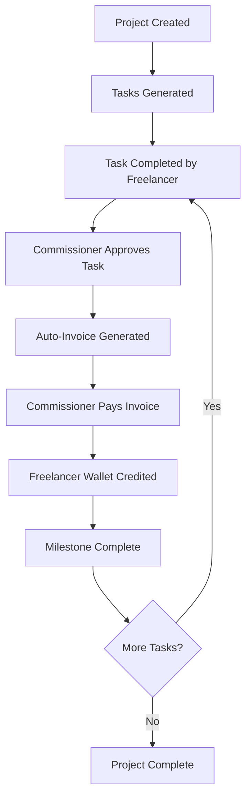
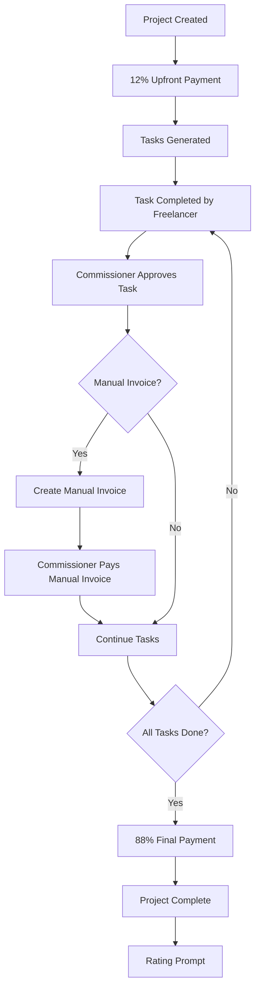

# 📋 **ARTISH Invoicing Methods: Code-Based Design Documentation**

## 🎯 **Overview**

ARTISH implements two completely separate invoicing methods for project execution:

1. **Milestone-Based Invoicing** - Original system for traditional project management
2. **Completion-Based Invoicing** - New system for simplified upfront + completion payments

Both systems are **completely isolated** with separate routes, services, and data storage to ensure zero cross-contamination.

---

## 🏗️ **1. MILESTONE-BASED INVOICING METHOD**

### **📁 Architecture Overview**
```
Milestone System (Original)
├── Routes: /api/payments/execute, /api/payments/trigger
├── Services: PaymentsService.processInvoicePayment()
├── Events: invoice.paid, milestone_payment_sent, task_approved
├── Invoice Types: milestone, auto_milestone, milestone_payment
└── Data: invoices.json, notifications.json
```

### **💰 Payment Flow**


### **🔧 Core Components**

#### **Payment Execution Route**
```typescript
// File: /api/payments/execute/route.ts
export async function POST(req: NextRequest) {
  // 1. Validate milestone invoice
  const invoice = await getInvoiceByNumber(invoiceNumber);
  assert(invoice.method === 'milestone', 'Only milestone invoices');
  
  // 2. Execute payment via PaymentsService
  const result = await PaymentsService.processInvoicePayment(invoice);
  
  // 3. Credit freelancer wallet
  await creditFreelancerWallet(invoice.freelancerId, invoice.totalAmount);
  
  // 4. Emit milestone events
  await emitBus('invoice.paid', { invoiceNumber, amount });
  
  return { success: true, transaction: result };
}
```

#### **Task Approval Route**
```typescript
// File: /api/project-tasks/submit/route.ts
export async function POST(req: NextRequest) {
  // 1. Approve task
  await updateTaskStatus(taskId, 'Approved');
  
  // 2. Auto-generate milestone invoice
  const invoice = await generateMilestoneInvoice(task);
  
  // 3. Emit task approval event
  await emitBus('task_approved', { taskId, projectId });
  
  return { success: true, invoice };
}
```

### **📊 Data Structures**

#### **Milestone Invoice**
```typescript
interface MilestoneInvoice {
  invoiceNumber: string;
  invoiceType: 'milestone' | 'auto_milestone' | 'milestone_payment';
  method: 'milestone';
  projectId: string;
  taskId: string;
  milestoneNumber: number;
  totalAmount: number;
  status: 'draft' | 'sent' | 'paid' | 'overdue';
  generatedAt: string;
  paidAt?: string;
}
```

#### **Milestone Project**
```typescript
interface MilestoneProject {
  projectId: string;
  invoicingMethod: 'milestone';
  executionMethod: 'milestone';
  totalTasks: number;
  completedTasks: number;
  milestones: MilestoneDefinition[];
  autoInvoicing: boolean;
}
```

---

## 🚀 **2. COMPLETION-BASED INVOICING METHOD**

### **📁 Architecture Overview**
```
Completion System (New)
├── Routes: /api/payments/completion/*, /api/invoices/completion/*
├── Services: CompletionCalculationService
├── Events: completion.project_activated, completion.upfront_payment, etc.
├── Invoice Types: completion_upfront, completion_manual, completion_final
└── Data: completion-notifications.json, completion-event-log.json
```

### **💰 Payment Flow**


### **🔧 Core Components**

#### **Project Creation Route**
```typescript
// File: /api/projects/completion/create/route.ts
export async function POST(req: NextRequest) {
  // 1. Create completion project
  const project = await createCompletionProject(projectData);
  
  // 2. Trigger upfront payment (12%)
  const upfrontResult = await executeUpfrontPayment(project.projectId);
  
  // 3. Emit dual notifications
  await handleCompletionNotification({
    type: 'completion.project_activated',
    context: { projectTitle, totalTasks }
  });
  
  await handleCompletionNotification({
    type: 'completion.upfront_payment', 
    context: { upfrontAmount, remainingBudget }
  });
  
  return { success: true, project, upfrontPayment: upfrontResult };
}
```

#### **Upfront Payment Route**
```typescript
// File: /api/payments/completion/execute-upfront/route.ts
export async function POST(req: NextRequest) {
  // 1. Calculate 12% upfront amount
  const upfrontAmount = CompletionCalculationService.calculateUpfrontAmount(totalBudget);
  
  // 2. Create upfront invoice
  const invoice = await createUpfrontInvoice(project, upfrontAmount);
  
  // 3. Execute payment
  const transaction = await executePayment(invoice);
  
  // 4. Credit freelancer wallet
  await creditFreelancerWallet(freelancerId, upfrontAmount);
  
  // 5. Emit upfront payment notification
  await handleCompletionNotification({
    type: 'completion.upfront_payment',
    context: { upfrontAmount, remainingBudget }
  });
  
  return { success: true, transaction, invoice };
}
```

### **📊 Data Structures**

#### **Completion Invoice Types**
```typescript
interface CompletionUpfrontInvoice {
  invoiceNumber: string;
  invoiceType: 'completion_upfront';
  method: 'completion';
  projectId: string;
  totalAmount: number; // 12% of total budget
  status: 'draft' | 'sent' | 'paid';
  percentage: 12;
}

interface CompletionManualInvoice {
  invoiceNumber: string;
  invoiceType: 'completion_manual';
  method: 'completion';
  projectId: string;
  taskId: string;
  totalAmount: number; // (88% ÷ total tasks)
  status: 'draft' | 'sent' | 'paid';
}

interface CompletionFinalInvoice {
  invoiceNumber: string;
  invoiceType: 'completion_final';
  method: 'completion';
  projectId: string;
  totalAmount: number; // 88% - manual payments
  status: 'draft' | 'sent' | 'paid';
  percentage: number; // Calculated remaining percentage
}
```

#### **Completion Project**
```typescript
interface CompletionProject {
  projectId: string;
  invoicingMethod: 'completion';
  executionMethod: 'completion';
  totalBudget: number;
  totalTasks: number;
  upfrontPaid: boolean;
  upfrontAmount: number; // 12% of total budget
  manualInvoiceAmount: number; // (88% ÷ total tasks)
  remainingBudget: number; // 88% of total budget
  completionPayments: {
    upfrontCompleted: boolean;
    manualInvoicesCount: number;
    finalPaymentCompleted: boolean;
  };
}
```

---

## 🔔 **3. NOTIFICATION ENGINEERING**

### **Milestone Notifications (3 types)**
```typescript
type MilestoneEventType = 
  | 'invoice.paid'              // When milestone invoice is paid
  | 'milestone_payment_sent'    // When milestone payment is sent  
  | 'task_approved';            // When milestone task is approved
```

### **Completion Notifications (8 types)**
```typescript
type CompletionEventType = 
  | 'completion.project_activated'    // Project acceptance
  | 'completion.upfront_payment'      // 12% upfront payment
  | 'completion.task_approved'        // Individual task approval
  | 'completion.invoice_received'     // Manual invoice from freelancer
  | 'completion.invoice_paid'         // Manual invoice payment
  | 'completion.project_completed'    // All tasks completed
  | 'completion.final_payment'        // 88% final payment
  | 'completion.rating_prompt';       // Rating request
```

---

## 🛡️ **4. SEPARATION GUARANTEES**

### **Route Isolation**
```
Milestone Routes:     /api/payments/execute, /api/project-tasks/submit
Completion Routes:    /api/payments/completion/*, /api/project-tasks/completion/*
```

### **Service Isolation**
```
Milestone Services:   PaymentsService.processInvoicePayment()
Completion Services:  CompletionCalculationService.*
```

### **Event Isolation**
```
Milestone Events:     invoice.paid, milestone_payment_sent
Completion Events:    completion.*, all prefixed with 'completion.'
```

### **Data Isolation**
```
Milestone Data:       invoices.json, notifications.json
Completion Data:      completion-notifications.json, completion-event-log.json
Shared Infrastructure: wallets.json, transactions.json (safe to share)
```

---

## 🎯 **5. CALCULATION DIFFERENCES**

### **Milestone Calculations**
- **Per Task**: (Total Budget ÷ Total Tasks) per milestone
- **Payment Timing**: After each task approval
- **Invoice Generation**: Automatic after task approval

### **Completion Calculations**
- **Upfront**: 12% of total budget (immediate)
- **Manual Invoice**: (88% ÷ Total Tasks) per task (optional)
- **Final Payment**: 88% - Manual Payments (when all tasks done)
- **Payment Timing**: Upfront + Final (with optional manual invoices)

---

## 🚀 **6. PRODUCTION STATUS**

### **✅ Milestone System**
- **Status**: Production Ready (Original System)
- **Routes**: All functional and tested
- **Integration**: Fully integrated with gig matching

### **✅ Completion System** 
- **Status**: Production Ready (New System)
- **Routes**: All functional and tested
- **Integration**: ⚠️ **MISSING** - Not integrated with gig matching

### **❌ Current Gap**
The completion-based invoicing system is fully implemented but **not integrated** with the gig request acceptance flow. Projects created via gig requests default to completion method but don't trigger the required upfront payment.

**Next Step**: Integrate completion-based invoicing with gig request acceptance to ensure upfront payments are executed before showing success notifications.
