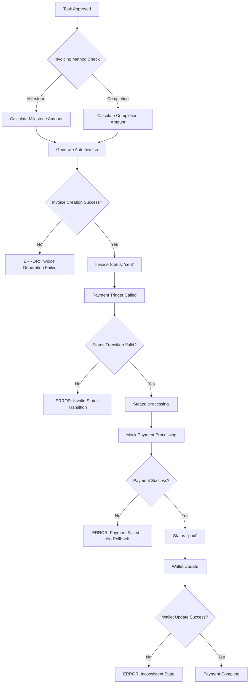

# Detailed Gig-to-Project-to-Payment Analysis

**Date:** August 13, 2025  
**Scope:** Deep technical analysis of complete workflow  
**Dataset:** 18 projects with validated trails  

## I. Detailed Workflow Analysis

### A. Gig Application Workflow (61.1% of projects)

#### Step 1: Gig Creation and Storage
```javascript
// Location: data/gigs/[year]/[month]/[day]/[gigId]/gig.json
{
  "id": 1,
  "title": "UX Audit & Accessibility Redesign",
  "organizationId": 7,
  "commissionerId": 38,
  "category": "Design",
  "hourlyRateMin": 90,        // Critical for payment calculation
  "hourlyRateMax": 130,       // Critical for payment calculation
  "estimatedHours": 40,       // Used in budget calculation
  "status": "Available",      // Must be "Available" for applications
  "deliveryTimeWeeks": 4
}
```

**Technical Dependencies:**
- Hierarchical storage path generation: `generateGigPath(postedDate, gigId)`
- Index synchronization: `data/gigs/gigs-index.json` updated atomically
- Rate validation: Must have `hourlyRateMin`/`hourlyRateMax` OR `budget` object

#### Step 2: Application Submission
```javascript
// Endpoint: POST /api/gigs/[id]/apply
// Storage: data/gigs/gig-applications/[year]/[month]/[day]/[applicationId].json

const application = {
  id: maxId + 1,
  gigId: parseInt(gigId),
  freelancerId: parseInt(freelancerId),
  pitch: "Application pitch text",
  sampleLinks: ["url1", "url2"],
  skills: ["React", "TypeScript"],
  tools: ["Figma", "Adobe XD"],
  submittedAt: "2025-08-13T10:30:00.000Z",
  status: "pending"                    // Critical for acceptance logic
};
```

**Critical Validations:**
- Gig status must be `'Available'`
- No duplicate applications from same freelancer
- Application data structure validation via Zod schemas

#### Step 3: Application Acceptance and Project Creation
```javascript
// Endpoint: POST /api/gigs/match-freelancer
// Uses: ProjectService.acceptGig()

const acceptResult = ProjectService.acceptGig({
  gig: gigData,
  freelancerId: Number(freelancerId),
  commissionerId: actorId,
});

// Project creation with budget calculation
const project = {
  projectId: finalProjectId,
  title: gig.title,
  status: 'ongoing',
  invoicingMethod: (gig.invoicingMethod || gig.executionMethod || 'completion'),
  totalBudget: gig.upperBudget || gig.lowerBudget,
  budget: {
    lower: calculateLowerBudget(gig),
    upper: calculateUpperBudget(gig),
    currency: 'USD'
  }
};
```

**Status Updates Performed:**
1. Gig status: `'Available'` → `'Unavailable'`
2. Application status: `'pending'` → `'accepted'`
3. Project creation with `status: 'ongoing'`

### B. Gig Request Workflow (38.9% of projects)

#### Step 1: Request Creation
```javascript
// Endpoint: POST /api/gigs/gig-requests/create
// Storage: data/gigs/gig-requests/[year]/[month]/[day]/[freelancerId].json

const gigRequest = {
  id: generateRequestId(),
  freelancerId: parseInt(freelancerId),
  commissionerId: parseInt(commissionerId),
  gigId: gigId || null,              // Optional gig reference
  title: "Project title",
  skills: ["React", "Node.js"],
  budget: {
    min: 1000,
    max: 5000,
    currency: "USD"
  },
  status: "pending"
};
```

#### Step 2: Request Acceptance and Project Creation
```javascript
// Endpoint: POST /api/gig-requests/[id]/accept
// Direct project creation with fallback logic

const gigData = gig || {
  title: gigRequest.title,
  description: gigRequest.notes || `Project for ${gigRequest.title}`,
  tags: gigRequest.skills || [],
  deliveryTimeWeeks: 4,
  status: 'Available'
};

const newProject = {
  projectId: newProjectId,
  title: gigData.title,
  invoicingMethod: (gigData.executionMethod || gigData.invoicingMethod || 'completion'),
  budget: {
    lower: gigData.lowerBudget || gigRequest.budget || 0,
    upper: gigData.upperBudget || gigRequest.budget || 0,
    currency: 'USD'
  }
};
```

## II. Payment Execution Logic Deep Dive

### A. Milestone-Based Invoicing

#### Invoice Generation Logic
```javascript
// Location: /api/invoices/auto-generate/route.ts
// Trigger: Task status change to "Approved"

const totalBudget = project.totalBudget || project.budget?.upper || project.budget?.lower || 5000;
const totalMilestones = project.totalTasks || 1;
const milestoneAmount = Math.round((totalBudget / totalMilestones) * 100) / 100;

const newInvoice = {
  invoiceNumber: `INV-${projectId}-${Date.now()}`,
  totalAmount: milestoneAmount,
  status: 'sent',                    // Auto-milestone invoices start as 'sent'
  invoiceType: 'auto_milestone',
  milestones: [{
    taskId: task.id,
    title: task.title,
    rate: milestoneAmount,
    status: 'approved'
  }]
};
```

#### Payment Trigger Sequence
```javascript
// 1. Payment Trigger: POST /api/payments/trigger
const updateOk = await updateInvoice(invoiceNumber, {
  status: 'processing',
  updatedAt: new Date().toISOString()
});

// 2. Transaction Logging
await appendTransaction({
  invoiceNumber,
  projectId: invoice.projectId,
  freelancerId: invoice.freelancerId,
  commissionerId: invoice.commissionerId,
  totalAmount: invoice.totalAmount,
  status: 'processing',
  integration: 'mock'
});

// 3. Payment Execution: POST /api/payments/execute
const paidDate = new Date().toISOString();
await updateInvoice(invoiceNumber, {
  status: 'paid',
  paidDate,
  updatedAt: paidDate
});
```

### B. Completion-Based Invoicing

#### Upfront Payment (12%)
```javascript
// Generated during project creation for completion-based projects
const upfrontAmount = totalBudget * 0.12;
const upfrontInvoice = {
  invoiceType: 'completion',
  milestoneNumber: 1,
  totalAmount: upfrontAmount,
  description: 'Upfront Payment'
};
```

#### Final Payment (88%)
```javascript
// Location: robust-invoice-service.ts
const upfrontCommitment = project.upfrontCommitment || project.upfrontAmount || (totalBudget * 0.12);
const remainingBudget = totalBudget - upfrontCommitment;
const paidTasks = await getPaidTasksCount(project.projectId);
const remainingTasks = Math.max(1, totalTasks - paidTasks);
const amountPerTask = remainingBudget / remainingTasks;
```

## III. Critical Data Flow Dependencies

### A. Budget Calculation Chain
```
Gig Rate Information → Project Budget → Invoice Amount → Payment Execution
```

**Detailed Flow:**
1. **Gig Level:** `hourlyRateMin: 90, hourlyRateMax: 130, estimatedHours: 40`
2. **Project Level:** `budget: { lower: 3600, upper: 5200 }` (calculated from gig rates)
3. **Invoice Level:** `totalAmount: 1300` (for 4-milestone project: 5200/4)
4. **Payment Level:** `amount: 1300` (exact match required)

### B. Status Synchronization Chain
```
Gig Status → Application Status → Project Status → Invoice Status → Payment Status
```

**Critical Transitions:**
- Gig: `'Available'` → `'Unavailable'` (on application acceptance)
- Application: `'pending'` → `'accepted'` (on commissioner approval)
- Project: Created with `'ongoing'` status
- Invoice: `'draft'` → `'sent'` → `'processing'` → `'paid'`

### C. Hierarchical Storage Dependencies
```
Index Files → Directory Structure → Data Files → Backup Indexes
```

**File Relationships:**
- `data/projects/metadata/projects-index.json` → Project lookup
- `data/projects/[year]/[month]/[day]/[projectId]/project.json` → Project data
- `data/project-tasks/metadata/tasks-index.json` → Task lookup
- `data/project-tasks/[year]/[month]/[day]/[taskId].json` → Task data

## IV. Identified Failure Scenarios

### A. Race Condition in Payment Processing
```javascript
// Scenario: Two commissioners try to pay same invoice simultaneously
// Current Code (VULNERABLE):
const invoice = await getInvoiceByNumber(invoiceNumber);
if (invoice.status !== 'sent') {
  return error('Invoice not in correct state');
}
// GAP: Another process could change status here
await updateInvoice(invoiceNumber, { status: 'processing' });
```

**Failure Impact:** Double payment processing, inconsistent invoice states

### B. Budget Calculation Overflow
```javascript
// Scenario: Very small budget with many tasks
const totalBudget = 100;  // $1.00
const totalTasks = 7;
const milestoneAmount = Math.round((totalBudget / totalTasks) * 100) / 100;
// Result: 14.29 * 7 = 100.03 (exceeds budget by $0.03)
```

**Failure Impact:** Budget overruns, payment validation failures

### C. Hierarchical Storage Path Mismatch
```javascript
// Scenario: Task createdDate doesn't match directory structure
const task = {
  taskId: 123,
  projectId: 456,
  createdDate: "2025-08-13T10:00:00.000Z"  // File created on 2025-08-12
};
// System tries to write to: /2025/08/13/123.json
// But should write to: /2025/08/12/123.json
```

**Failure Impact:** Data corruption, unfindable tasks, index inconsistencies

## V. executionMethod vs invoicingMethod Clarification

### A. Field Purpose Distinction
```javascript
// executionMethod: How the project evolves/progresses
executionMethod: 'milestone'  // Project tracked milestone-by-milestone
executionMethod: 'completion' // Project tracked as single completion unit

// invoicingMethod: How payments are processed
invoicingMethod: 'milestone'  // Equal payment per milestone
invoicingMethod: 'completion' // Upfront + final payment structure
```

### B. Current Problematic Logic
```javascript
// CURRENT (PROBLEMATIC):
invoicingMethod: (gig.invoicingMethod || gig.executionMethod || 'completion')

// SHOULD BE:
executionMethod: gig.executionMethod || 'milestone',
invoicingMethod: gig.invoicingMethod || gig.executionMethod || 'completion'
```

### C. Impact on Payment Logic
```javascript
// Payment calculation should ONLY use invoicingMethod
if (project.invoicingMethod === 'milestone') {
  // Equal distribution across all tasks
  amount = totalBudget / totalTasks;
} else if (project.invoicingMethod === 'completion') {
  // Upfront + completion structure
  amount = isUpfront ? (totalBudget * 0.12) : (totalBudget * 0.88);
}
```

## VI. System Architecture Vulnerabilities

### A. Atomic Operation Gaps
**Missing Atomic Wrappers:**
- Payment status transitions
- Budget calculation and validation
- Index synchronization with data writes

### B. Concurrent Access Vulnerabilities
**File Lock Limitations:**
- In-memory locks don't survive process restarts
- No deadlock detection mechanism
- No timeout handling for stuck locks

### C. Error Recovery Limitations
**Missing Rollback Scenarios:**
- Failed payment execution
- Partial invoice status updates
- Corrupted hierarchical storage writes

## VII. Code Flow Analysis

### A. Complete Gig Application Flow with Error Points
```mermaid
graph TD
    A[Gig Posted] --> B{Gig Status Check}
    B -->|Available| C[Application Submitted]
    B -->|Unavailable| X1[ERROR: Gig Not Available]

    C --> D[Application Stored]
    D --> E{Commissioner Review}
    E -->|Accept| F[ProjectService.acceptGig()]
    E -->|Reject| X2[Application Rejected]

    F --> G{Gig Rate Validation}
    G -->|Valid| H[Project Created]
    G -->|Invalid| X3[ERROR: Missing Rate Info]

    H --> I[Status Updates]
    I --> J{All Updates Success?}
    J -->|Yes| K[Project Activated]
    J -->|No| X4[ERROR: Partial State Update]

    K --> L[Task Generation]
    L --> M[Ready for Work]
```

### B. Payment Execution Flow with Failure Points


### C. Data Structure Dependencies
```javascript
// Complete data relationship map
const dataRelationships = {
  gig: {
    id: "Primary key",
    commissionerId: "→ users.json",
    organizationId: "→ organizations.json",
    hourlyRateMin: "→ project.budget.lower calculation",
    hourlyRateMax: "→ project.budget.upper calculation",
    status: "Controls application acceptance"
  },

  gigApplication: {
    id: "Primary key",
    gigId: "→ gigs/[path]/gig.json",
    freelancerId: "→ users.json",
    status: "Controls project creation"
  },

  project: {
    projectId: "Primary key",
    gigId: "→ gigs/[path]/gig.json (optional)",
    freelancerId: "→ users.json",
    commissionerId: "→ users.json",
    budget: "→ invoice amount calculations",
    invoicingMethod: "→ payment logic routing",
    executionMethod: "→ project progress tracking"
  },

  invoice: {
    invoiceNumber: "Primary key",
    projectId: "→ projects/[path]/project.json",
    freelancerId: "→ users.json",
    commissionerId: "→ users.json",
    totalAmount: "Must align with project budget",
    status: "Controls payment processing"
  }
};
```

## VIII. Detailed Failure Scenario Analysis

### A. Concurrent Payment Processing Race Condition
```javascript
// VULNERABLE CODE PATTERN:
async function processPayment(invoiceNumber) {
  // Step 1: Read invoice (RACE CONDITION WINDOW)
  const invoice = await getInvoiceByNumber(invoiceNumber);

  // Step 2: Validate status (ANOTHER PROCESS COULD CHANGE STATUS HERE)
  if (invoice.status !== 'sent') {
    throw new Error('Invalid status');
  }

  // Step 3: Update to processing (TOO LATE - RACE CONDITION)
  await updateInvoice(invoiceNumber, { status: 'processing' });

  // Step 4: Process payment (COULD FAIL, LEAVING INCONSISTENT STATE)
  const paymentResult = await processPayment(invoice);

  // Step 5: Update to paid (NO ROLLBACK IF THIS FAILS)
  await updateInvoice(invoiceNumber, { status: 'paid' });
}

// FAILURE SCENARIOS:
// 1. Two commissioners trigger payment simultaneously
// 2. Payment processing fails after status update
// 3. Database/file system failure during status update
```

### B. Budget Calculation Precision Errors
```javascript
// PROBLEMATIC CALCULATION:
function calculateMilestoneAmount(totalBudget, totalTasks) {
  return Math.round((totalBudget / totalTasks) * 100) / 100;
}

// FAILURE EXAMPLES:
const scenarios = [
  {
    budget: 1000,    // $10.00
    tasks: 3,
    perTask: 333.33, // $3.33
    total: 999.99,   // $9.99 (missing $0.01)
    issue: "Budget underrun"
  },
  {
    budget: 1000,    // $10.00
    tasks: 7,
    perTask: 142.86, // $1.43 (rounded)
    total: 1000.02,  // $10.00 (exceeds by $0.02)
    issue: "Budget overrun"
  }
];

// COMPOUNDING ISSUE:
// If 6 tasks are paid at $1.43 each = $8.58
// Final task gets: $10.00 - $8.58 = $1.42
// But system calculates: $1.43
// Result: Payment validation failure
```

### C. Hierarchical Storage Path Corruption
```javascript
// VULNERABLE PATH GENERATION:
function generateTaskPath(task) {
  const date = new Date(task.createdDate);
  const year = date.getFullYear();
  const month = String(date.getMonth() + 1).padStart(2, '0');
  const day = String(date.getDate()).padStart(2, '0');

  return `data/project-tasks/${year}/${month}/${day}/${task.taskId}.json`;
}

// FAILURE SCENARIO:
const task = {
  taskId: 123,
  createdDate: "2025-08-13T23:30:00.000Z"  // UTC time
};

// If server timezone is PST (-8 hours):
// Local time: 2025-08-13 15:30:00
// File written to: /2025/08/13/123.json
// But task.createdDate indicates: 2025-08-13
// Later, system looks for task in /2025/08/13/ ✓

// If server timezone changes or task created near midnight:
// UTC: 2025-08-14T01:30:00.000Z
// PST: 2025-08-13 17:30:00
// File written to: /2025/08/13/123.json
// But UTC date is 2025-08-14
// Index shows: "123": "2025-08-14T01:30:00.000Z"
// System looks in: /2025/08/14/ ✗ (file not found)
```

## IX. Performance and Scalability Analysis

### A. File System Bottlenecks
```javascript
// CURRENT LOCKING MECHANISM:
const fileLocks = new Map(); // In-memory only

async function withFileLock(filePath, fn) {
  const lockKey = path.resolve(filePath);

  // BOTTLENECK 1: Busy waiting
  while (fileLocks.has(lockKey)) {
    await fileLocks.get(lockKey);  // No timeout
  }

  // BOTTLENECK 2: No deadlock detection
  const lockPromise = (async () => {
    try {
      return await fn();
    } finally {
      fileLocks.delete(lockKey);  // BOTTLENECK 3: No error recovery
    }
  })();

  fileLocks.set(lockKey, lockPromise.then(() => {}));
  return lockPromise;
}

// SCALABILITY ISSUES:
// 1. Memory usage grows with concurrent operations
// 2. No lock timeout (can hang indefinitely)
// 3. No priority system for critical operations
// 4. Locks lost on process restart
```

### B. Index Synchronization Overhead
```javascript
// CURRENT INDEX UPDATE PATTERN:
async function writeProject(project) {
  // 1. Write project data
  await atomicWrite(projectPath, project);

  // 2. Update main index (SEPARATE OPERATION)
  await updateProjectIndexes(project);

  // 3. Update metadata index (ANOTHER SEPARATE OPERATION)
  await updateMetadataIndex(project);
}

// PERFORMANCE ISSUES:
// 1. 3 separate file operations per project write
// 2. No batch index updates
// 3. Index locks can block data writes
// 4. No index rebuild mechanism for corruption recovery
```

## X. Security and Data Integrity Concerns

### A. Payment Authorization Gaps
```javascript
// CURRENT AUTHORIZATION CHECK:
async function executePayment(invoiceNumber, commissionerId) {
  const invoice = await getInvoiceByNumber(invoiceNumber);

  // SECURITY GAP: Only checks commissioner ID match
  if (invoice.commissionerId !== commissionerId) {
    throw new Error('Unauthorized');
  }

  // MISSING CHECKS:
  // 1. Is commissioner account active?
  // 2. Does commissioner have sufficient funds/credit?
  // 3. Is this a duplicate payment attempt?
  // 4. Has the project been completed/approved?
  // 5. Are there any payment holds or disputes?
}
```

### B. Data Validation Gaps
```javascript
// INSUFFICIENT VALIDATION:
const project = {
  budget: {
    lower: -1000,        // NEGATIVE BUDGET ALLOWED
    upper: "invalid",    // STRING IN NUMERIC FIELD
    currency: null       // NULL CURRENCY
  },
  totalTasks: 0,         // DIVISION BY ZERO RISK
  invoicingMethod: "xyz" // INVALID METHOD
};

// MISSING VALIDATIONS:
// 1. Budget range validation (lower <= upper)
// 2. Positive amount validation
// 3. Currency code validation
// 4. Task count minimum validation
// 5. Enum validation for methods
```

This comprehensive technical analysis reveals the intricate dependencies and multiple failure points in your gig-to-project-to-payment system, providing the detailed view needed for robust testing and improvement planning.
