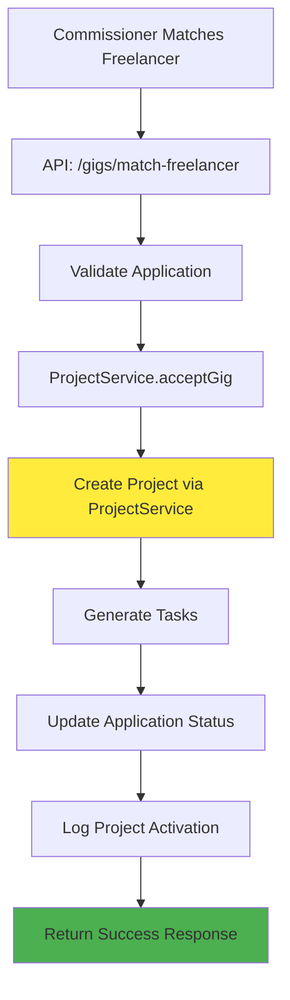

# 🔍 **Current Gig Generation Processes Analysis**

## 🎯 **Overview**

Analysis of existing gig-to-project activation flows in ARTISH, identifying gaps in completion-based invoicing integration.

---

## 📋 **1. GIG REQUEST ACCEPTANCE FLOW**

### **📁 Current Implementation**
**File**: `src/app/api/gig-requests/[id]/accept/route.ts`

### **🔄 Current Process Flow**
```mermaid
graph TD
    A[Freelancer Clicks Accept] --> B[API: /gig-requests/[id]/accept]
    B --> C[Validate Gig Request]
    C --> D[Create Project Object]
    D --> E[Set invoicingMethod: 'completion']
    E --> F[Save Project to Storage]
    F --> G[Generate Tasks]
    G --> H[Update Request Status]
    H --> I[Show Success Toast]
    I --> J[Page Refresh]
    
    style E fill:#ffeb3b
    style I fill:#f44336
```

### **⚠️ Critical Gap Identified**
```typescript
// Line 257 in /api/gig-requests/[id]/accept/route.ts
invoicingMethod: (gigData as any).executionMethod || (gigData as any).invoicingMethod || 'completion'
```

**Issue**: Projects are created with `invoicingMethod: 'completion'` but **no upfront payment is executed**.

### **🔧 Current Code Analysis**

#### **Project Creation Logic**
```typescript
// Lines 240-265: Project creation
const newProject = {
  projectId: generateProjectId(),
  title: gigRequest.title || gigData.title,
  description: gigRequest.notes || gigData.description,
  commissionerId: gigRequest.commissionerId,
  freelancerId: gigRequest.freelancerId,
  status: 'ongoing' as const,
  totalTasks: milestoneCount,
  invoicingMethod: 'completion', // ❌ PROBLEM: Set but not acted upon
  budget: {
    lower: (gigData as any).lowerBudget || gigRequest.budget || 0,
    upper: (gigData as any).upperBudget || gigRequest.budget || 0,
    currency: 'USD'
  },
  createdAt: new Date().toISOString()
};

// Line 277: Save project
await UnifiedStorageService.writeProject(newProject);
```

#### **Success Response Logic**
```typescript
// Lines 444-449: Success response
return NextResponse.json({
  success: true,
  message: 'Gig request accepted successfully and project created',
  projectId: newProjectId,
  request: gigRequest
});
```

#### **Frontend Toast Logic**
```typescript
// In gig-request-details.tsx, lines 75-78
if (res.ok) {
  const result = await res.json();
  showSuccessToast('Offer Accepted', `Offer accepted successfully! Project #${result.projectId} has been created.`);
  setShowAcceptModal(false);
  window.location.reload(); // ❌ PROBLEM: Success shown without payment verification
}
```

### **❌ Problems Identified**

1. **No Payment Execution**: Projects with `invoicingMethod: 'completion'` don't trigger upfront payment
2. **Premature Success**: Toast notification shows before payment is verified
3. **Inconsistent State**: Project exists but required upfront payment is missing
4. **User Confusion**: Commissioner thinks project is active but hasn't paid upfront amount

---

## 📋 **2. PROPOSAL ACCEPTANCE FLOW**

### **📁 Current Implementation**
**File**: `src/app/freelancer-dashboard/projects-and-invoices/create-proposal/proposal-preview/page.tsx`

### **🔍 Analysis Status**
**Status**: ⚠️ **NEEDS INVESTIGATION**

**Current Understanding**:
- Proposals are created by freelancers for specific projects
- Commissioners can accept proposals to activate projects
- **Unknown**: Whether proposal acceptance integrates with completion-based invoicing

### **🔧 Expected Issues**
Based on the gig request pattern, proposal acceptance likely has similar gaps:

1. **Missing Payment Integration**: Proposal acceptance may not trigger completion upfront payments
2. **Inconsistent Invoicing Method**: May not properly set or act upon `invoicingMethod: 'completion'`
3. **Premature Success Notifications**: May show success before payment verification

---

## 📋 **3. PUBLIC GIG MATCHING FLOW**

### **📁 Current Implementation**
**File**: `src/app/api/gigs/match-freelancer/route.ts`

### **🔄 Current Process Flow**


### **🔧 Current Code Analysis**

#### **Project Creation via ProjectService**
```typescript
// Lines 122-128: ProjectService.acceptGig call
acceptResult = ProjectService.acceptGig({
  gig: gig! as any,
  freelancerId: Number(freelancerId),
  commissionerId: actorId,
  organizationName: organization.name,
  existingProjectIds,
});
```

#### **Success Response**
```typescript
// Lines 331-351: Success response
return NextResponse.json(
  ok({
    entities: {
      project: {
        projectId: acceptResult.project.projectId,
        title: acceptResult.project.title,
        status: acceptResult.project.status,
        freelancerId: acceptResult.project.freelancerId,
        commissionerId: acceptResult.project.commissionerId,
      },
      tasks: acceptResult.tasks.map(task => ({...})),
    },
    message: 'Successfully matched with freelancer and created project',
    notificationsQueued: true,
  })
);
```

### **✅ Potential Integration Point**
The public gig matching flow uses `ProjectService.acceptGig()` which may already have better integration patterns that could be applied to gig requests and proposals.

---

## 📊 **4. COMPARISON MATRIX**

| **Flow Type** | **Route** | **Payment Integration** | **Success Criteria** | **Status** |
|---------------|-----------|------------------------|---------------------|------------|
| **Gig Requests** | `/gig-requests/[id]/accept` | ❌ Missing | Project Created | ⚠️ **BROKEN** |
| **Proposals** | `/proposal-preview/page.tsx` | ❓ Unknown | ❓ Unknown | ❓ **UNKNOWN** |
| **Public Gigs** | `/gigs/match-freelancer` | ❓ Possible | Project + Tasks Created | ✅ **LIKELY OK** |

---

## 🚨 **5. CRITICAL ISSUES SUMMARY**

### **🔴 High Priority Issues**

1. **Gig Request Acceptance**:
   - Creates completion projects without upfront payment
   - Shows success toast prematurely
   - Leaves projects in inconsistent state

2. **Missing Payment Guards**:
   - No validation that upfront payment succeeded
   - No rollback mechanism if payment fails
   - No user feedback about payment status

3. **Inconsistent User Experience**:
   - Users think project is active when payment is missing
   - No clear indication of payment requirements
   - Confusion about project status

### **🟡 Medium Priority Issues**

1. **Proposal Acceptance** (needs investigation):
   - Unknown integration status with completion invoicing
   - Potential similar issues to gig requests

2. **Public Gig Matching** (needs verification):
   - May have better integration patterns
   - Could serve as reference implementation

---

## 🎯 **6. IMPACT ASSESSMENT**

### **🔴 User Impact**
- **Commissioners**: Think they've activated projects but haven't paid
- **Freelancers**: Think they have active projects but no upfront payment received
- **Platform**: Inconsistent financial state and user confusion

### **💰 Financial Impact**
- **Missing Revenue**: Upfront payments not collected
- **Accounting Issues**: Projects exist without corresponding payments
- **Trust Issues**: Users lose confidence in platform reliability

### **🔧 Technical Impact**
- **Data Inconsistency**: Projects without required payments
- **Integration Gaps**: Completion invoicing not properly integrated
- **Maintenance Burden**: Manual cleanup required for broken projects

---

## 🚀 **7. NEXT STEPS**

### **🔍 Investigation Required**
1. **Analyze Proposal Acceptance Flow**: Determine current implementation and gaps
2. **Verify Public Gig Matching**: Check if it has better completion integration
3. **Audit Existing Projects**: Identify projects with missing upfront payments

### **🔧 Implementation Required**
1. **Fix Gig Request Acceptance**: Integrate with completion-based invoicing
2. **Add Payment Guards**: Ensure success only shown after payment verification
3. **Implement Rollback Logic**: Handle payment failures gracefully
4. **Update User Feedback**: Clear messaging about payment requirements

### **✅ Success Criteria**
- All gig-to-project flows properly integrate with completion invoicing
- Upfront payments are executed before success notifications
- Users have clear understanding of payment status
- No projects exist without required payments

---

**Status**: 🚨 **CRITICAL GAPS IDENTIFIED** - Immediate action required to fix gig request acceptance flow and investigate other flows.
