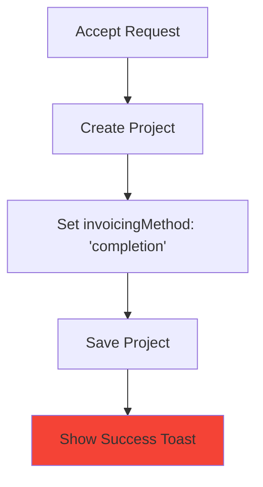
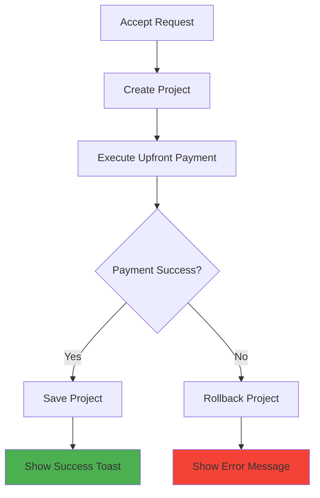

# 🚀 **Gig-to-Project Completion Invoicing Integration Guide**

## 🎯 **Objective**

Integrate completion-based invoicing with all gig-to-project activation flows to ensure:
1. **Upfront payments are executed** before success notifications
2. **Payment guards prevent** incomplete project activation
3. **Consistent user experience** across all project creation flows
4. **Proper error handling** for payment failures

---

## 🔧 **1. GIG REQUEST ACCEPTANCE INTEGRATION**

### **🎯 Target File**
`src/app/api/gig-requests/[id]/accept/route.ts`

### **🔄 Current vs Required Flow**

#### **❌ Current Broken Flow**


#### **✅ Required Fixed Flow**


### **🔧 Implementation Steps**

#### **Step 1: Add Completion Project Creation Logic**
```typescript
// Replace lines 240-277 with completion-aware project creation
async function createCompletionProject(gigRequest: any, gigData: any) {
  const projectData = {
    title: gigRequest.title || gigData.title,
    description: gigRequest.notes || gigData.description,
    totalBudget: gigData.upperBudget || gigRequest.budget || 0,
    totalTasks: calculateMilestoneCount(gigData),
    executionMethod: 'completion',
    invoicingMethod: 'completion',
    freelancerId: gigRequest.freelancerId,
    commissionerId: gigRequest.commissionerId,
    organizationId: gigRequest.organizationId
  };

  // Use completion project creation route
  const response = await fetch(`${process.env.NEXTAUTH_URL}/api/projects/completion/create`, {
    method: 'POST',
    headers: { 'Content-Type': 'application/json' },
    body: JSON.stringify(projectData)
  });

  if (!response.ok) {
    throw new Error('Failed to create completion project');
  }

  return await response.json();
}
```

#### **Step 2: Add Payment Verification Logic**
```typescript
// Add after project creation
async function verifyUpfrontPayment(projectId: string) {
  // Check if upfront payment was successful
  const project = await getProjectById(projectId);
  
  if (!project.upfrontPaid) {
    throw new Error('Upfront payment failed - project activation incomplete');
  }
  
  return project;
}
```

#### **Step 3: Update Main Route Logic**
```typescript
export async function POST(req: NextRequest) {
  try {
    // ... existing validation logic ...

    // Create completion project with upfront payment
    const projectResult = await createCompletionProject(gigRequest, gigData);
    
    if (!projectResult.success) {
      throw new Error('Project creation failed');
    }

    // Verify upfront payment was successful
    const verifiedProject = await verifyUpfrontPayment(projectResult.data.project.projectId);
    
    // Only proceed if payment succeeded
    if (verifiedProject.upfrontPaid) {
      // ... existing task generation logic ...
      
      return NextResponse.json({
        success: true,
        message: 'Gig request accepted and upfront payment processed successfully',
        projectId: verifiedProject.projectId,
        upfrontPayment: {
          amount: verifiedProject.upfrontAmount,
          status: 'paid'
        },
        request: gigRequest
      });
    } else {
      throw new Error('Upfront payment verification failed');
    }

  } catch (error) {
    // Rollback logic
    if (projectResult?.data?.project?.projectId) {
      await rollbackProject(projectResult.data.project.projectId);
    }
    
    return NextResponse.json({
      success: false,
      error: 'Failed to accept gig request: ' + error.message,
      details: 'Upfront payment could not be processed'
    }, { status: 400 });
  }
}
```

#### **Step 4: Add Rollback Logic**
```typescript
async function rollbackProject(projectId: string) {
  try {
    // Remove project from storage
    await UnifiedStorageService.deleteProject(projectId);
    
    // Remove any generated tasks
    await UnifiedStorageService.deleteTasksByProject(projectId);
    
    // Log rollback for debugging
    console.warn(`Rolled back project ${projectId} due to payment failure`);
  } catch (error) {
    console.error(`Failed to rollback project ${projectId}:`, error);
  }
}
```

### **🎨 Frontend Integration**

#### **Update GigRequestDetails Component**
```typescript
// In gig-request-details.tsx
const handleAcceptOffer = async () => {
  setIsAccepting(true);
  
  try {
    const res = await fetch(`/api/gig-requests/${request.id}/accept`, {
      method: 'POST',
      headers: { 'Content-Type': 'application/json' },
    });
    
    const result = await res.json();
    
    if (result.success) {
      // Show success with payment confirmation
      showSuccessToast(
        'Offer Accepted & Payment Processed', 
        `Project #${result.projectId} created successfully! Upfront payment of $${result.upfrontPayment.amount} has been processed.`
      );
      setShowAcceptModal(false);
      window.location.reload();
    } else {
      // Show specific error message
      showErrorToast(
        'Acceptance Failed', 
        result.details || 'Could not process upfront payment. Please try again.'
      );
    }
  } catch (error) {
    showErrorToast('Error', 'Failed to accept offer. Please try again.');
  } finally {
    setIsAccepting(false);
  }
};
```

---

## 🔧 **2. PROPOSAL ACCEPTANCE INTEGRATION**

### **🎯 Target File**
`src/app/freelancer-dashboard/projects-and-invoices/create-proposal/proposal-preview/page.tsx`

### **🔍 Investigation Required**
Before implementation, need to:

1. **Analyze Current Flow**: Understand how proposals are accepted
2. **Identify API Endpoints**: Find proposal acceptance routes
3. **Check Integration**: Determine if completion invoicing is already integrated

### **🔧 Expected Implementation Pattern**
```typescript
// Similar pattern to gig requests
const handleAcceptProposal = async () => {
  try {
    // Call completion-aware proposal acceptance
    const response = await fetch('/api/proposals/accept-with-completion', {
      method: 'POST',
      headers: { 'Content-Type': 'application/json' },
      body: JSON.stringify({
        proposalId,
        invoicingMethod: 'completion'
      })
    });
    
    const result = await response.json();
    
    if (result.success && result.upfrontPayment?.status === 'paid') {
      showSuccessToast('Proposal Accepted', 
        `Project created with upfront payment of $${result.upfrontPayment.amount}`);
    } else {
      showErrorToast('Payment Failed', 'Could not process upfront payment');
    }
  } catch (error) {
    showErrorToast('Error', 'Failed to accept proposal');
  }
};
```

---

## 🔧 **3. PUBLIC GIG MATCHING INTEGRATION**

### **🎯 Target File**
`src/app/api/gigs/match-freelancer/route.ts`

### **🔍 Current Analysis**
The public gig matching uses `ProjectService.acceptGig()` which may need updating:

### **🔧 Required Updates**

#### **Update ProjectService.acceptGig**
```typescript
// In ProjectService
static async acceptGig(params: {
  gig: any,
  freelancerId: number,
  commissionerId: number,
  organizationName: string,
  existingProjectIds: string[]
}) {
  const { gig, freelancerId, commissionerId } = params;
  
  // Check if gig uses completion invoicing
  if (gig.invoicingMethod === 'completion' || gig.executionMethod === 'completion') {
    // Use completion project creation
    return await this.createCompletionProject({
      ...params,
      totalBudget: gig.upperBudget || gig.budget,
      totalTasks: gig.milestones?.length || 4
    });
  } else {
    // Use existing milestone project creation
    return await this.createMilestoneProject(params);
  }
}

static async createCompletionProject(params: any) {
  // Call completion project creation API
  const response = await fetch('/api/projects/completion/create', {
    method: 'POST',
    headers: { 'Content-Type': 'application/json' },
    body: JSON.stringify({
      title: params.gig.title,
      description: params.gig.description,
      totalBudget: params.totalBudget,
      totalTasks: params.totalTasks,
      executionMethod: 'completion',
      invoicingMethod: 'completion',
      freelancerId: params.freelancerId,
      commissionerId: params.commissionerId
    })
  });
  
  const result = await response.json();
  
  if (!result.success || !result.data.project.upfrontPaid) {
    throw new Error('Completion project creation or upfront payment failed');
  }
  
  return result.data;
}
```

---

## 🛡️ **4. UNIVERSAL PAYMENT GUARDS**

### **🔧 Guard Implementation**

#### **Payment Verification Middleware**
```typescript
// Create: src/lib/guards/completion-payment-guard.ts
export class CompletionPaymentGuard {
  static async verifyProjectActivation(projectId: string): Promise<boolean> {
    try {
      const project = await getProjectById(projectId);
      
      if (project.invoicingMethod !== 'completion') {
        return true; // Not a completion project, no guard needed
      }
      
      // For completion projects, verify upfront payment
      return project.upfrontPaid === true;
    } catch (error) {
      console.error('Payment verification failed:', error);
      return false;
    }
  }
  
  static async enforcePaymentBeforeSuccess(
    projectId: string, 
    successCallback: () => void,
    failureCallback: (error: string) => void
  ) {
    const isValid = await this.verifyProjectActivation(projectId);
    
    if (isValid) {
      successCallback();
    } else {
      failureCallback('Project activation incomplete - upfront payment required');
    }
  }
}
```

#### **Universal Success Handler**
```typescript
// Create: src/lib/handlers/project-activation-handler.ts
export class ProjectActivationHandler {
  static async handleActivationSuccess(
    projectId: string,
    context: {
      type: 'gig-request' | 'proposal' | 'public-gig',
      showToast: (title: string, message: string) => void,
      onSuccess: () => void,
      onError: (error: string) => void
    }
  ) {
    try {
      const project = await getProjectById(projectId);
      
      if (project.invoicingMethod === 'completion') {
        // Verify upfront payment for completion projects
        if (project.upfrontPaid) {
          context.showToast(
            'Project Activated Successfully',
            `Project #${projectId} created with upfront payment of $${project.upfrontAmount}`
          );
          context.onSuccess();
        } else {
          throw new Error('Upfront payment not completed');
        }
      } else {
        // Standard success for milestone projects
        context.showToast(
          'Project Created Successfully',
          `Project #${projectId} has been created`
        );
        context.onSuccess();
      }
    } catch (error) {
      context.onError(error.message);
    }
  }
}
```

---

## 📋 **5. IMPLEMENTATION CHECKLIST**

### **🔴 Phase 1: Critical Fixes (Immediate)**
- [ ] Fix gig request acceptance to use completion project creation
- [ ] Add payment verification before success notifications
- [ ] Implement rollback logic for payment failures
- [ ] Update frontend error handling

### **🟡 Phase 2: Investigation & Analysis**
- [ ] Analyze proposal acceptance flow
- [ ] Verify public gig matching integration
- [ ] Audit existing projects for missing payments
- [ ] Document all gig-to-project flows

### **🟢 Phase 3: Universal Integration**
- [ ] Implement universal payment guards
- [ ] Create unified project activation handler
- [ ] Update all flows to use completion integration
- [ ] Add comprehensive error handling

### **🔵 Phase 4: Testing & Validation**
- [ ] Test all gig-to-project flows
- [ ] Verify payment execution in each flow
- [ ] Test error scenarios and rollbacks
- [ ] Validate user experience consistency

---

## 🎯 **6. SUCCESS CRITERIA**

### **✅ Technical Success**
- All gig-to-project flows integrate with completion invoicing
- Upfront payments execute before success notifications
- Payment failures trigger proper rollbacks
- No projects exist without required payments

### **✅ User Experience Success**
- Clear feedback about payment status
- Consistent behavior across all flows
- Proper error messages for payment failures
- No confusion about project activation status

### **✅ Business Success**
- All upfront payments are collected
- Financial data consistency maintained
- User trust in platform reliability
- Reduced support tickets about payment issues

---

**Priority**: 🚨 **CRITICAL** - The gig request acceptance flow is currently broken and needs immediate attention to prevent further incomplete project activations.
